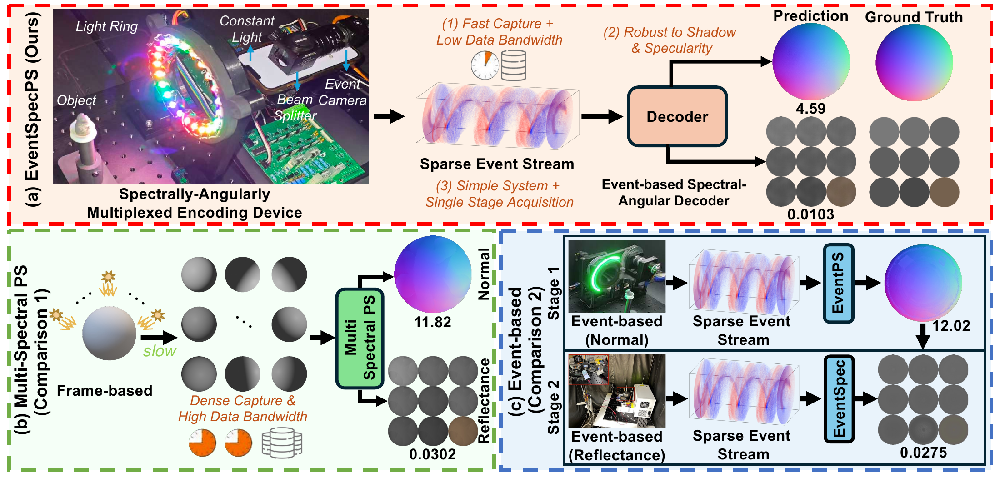
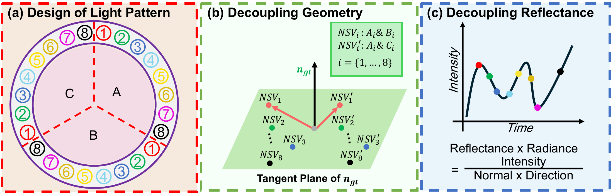
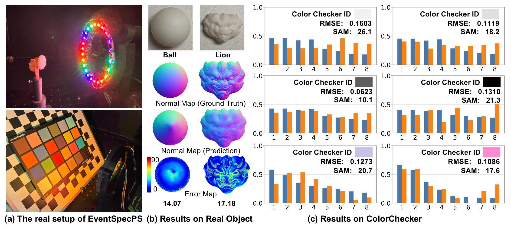

<div align="center">

# EventSpecPS: Photometric Stereo with Multispectral Reflectance Using an Event Camera

**ECCV 2026**

Jingqian Wu · Bohan Yu · Jun Hoong Chan · Edmund Y. Lam · Boxin Shi

The University of Hong Kong · Peking University<br>

**One event stream. Joint surface geometry and multispectral reflectance.**

[Overview](#overview) · [Method](#method) · [Quick start](#quick-start) · [Rendering](#synthetic-rendering) · [Citation](#citation)



<sub>EventSpecPS encodes spectral and geometric cues in a single-stage, sparse event acquisition.</sub>

</div>

## Overview

Recovering both **surface shape** and **wavelength-dependent reflectance** usually requires dense multispectral images or separate acquisition stages. EventSpecPS combines an event camera with spectrally-angularly multiplexed illumination to recover both from a single event stream, enabling fast, low-bandwidth acquisition.

This repository contains the **ECCV core Python decoder and rendering-configuration generator**. It does not bundle datasets, geometry assets, pretrained models, renderer binaries, or experiment-management scripts. The decoder optimizes each scene directly; no training dataset or pretrained network is required.

## Method

<p align="center">
  
</p>

- **Encode.** A 24-LED ring interleaves eight spectral channels, each repeated at three angular positions. A known illumination schedule encodes geometry and reflectance into asynchronous events.
- **Anchor the scale.** A calibrated constant-light component breaks the reflectance-scale ambiguity of relative event measurements.
- **Decode jointly.** The PyTorch solver fits surface normals and nonnegative spectral-reflectance factors to consecutive event pairs. Angular weighting, lightweight spatial regularization, and physical constraints stabilize the reconstruction.

The public code retains the ECCV solver's local computation and defaults; cleanup is limited to unused debugging dependencies and release-facing metadata.

### Real-world results

<p align="center">
  
</p>

Original ECCV results: the capture setup, reconstructed surface normals with angular error maps, and eight-band ColorChecker reflectance comparisons. The paper figures are included for illustration; their underlying data are not bundled here.

## Quick start

### Install

Use **Python 3.11** on Linux. A CUDA-capable GPU is recommended for reconstruction.

```bash
git clone https://github.com/Wujingqian/EventSpecPS.git
cd EventSpecPS
python3.11 -m venv .venv
source .venv/bin/activate
python -m pip install -r requirements.txt
```

The reference environment uses PyTorch **2.7.1** and torchvision **0.22.1** (CUDA 12.6 builds). Install a matching PyTorch/torchvision pair appropriate for your driver; the Python solver does not require the Rust renderer. For headless use, set `MPLBACKEND=Agg` or pass `--skip-visualizations`.

### Reconstruct a scene

Run from the repository root, using your own prepared scene:

```bash
python -m EventSpecPS.python.map_solver.event_map_solver \
  --data /path/to/scene \
  --output-dir outputs/my_scene \
  --device cuda \
  --skip-visualizations
```

The default is **1,600 optimization iterations** with eight reflectance factors. Use `--max_pixel_iters` to change the iteration count, `--random-seed` to set initialization, and `--constant-light` to supply the calibrated additive intensity component (default `0.5` in the solver's intensity convention). See `--help` for all options. CPU execution is available with `--device cpu`, but is slower.

| Output | Contents |
| --- | --- |
| `final_normal.npy` | Surface normals, shape `(H, W, 3)` |
| `final_ref.npy` | Multispectral reflectance, shape `(H, W, N_bands)` |
| `cache/cache.pt` | Preprocessed event pairs |
| `run_manifest.json` | Runtime arguments and source information |
| `visualizations/` | Preview images, unless skipped |

Use a fresh output directory for a different acquisition or calibration: cached pairs are not automatically invalidated. Load only trusted `.pt` caches. Preview reflectance images retain the legacy display scaling; use `final_ref.npy` for the unmodified numerical output.

### Input format

Each scene needs a `render.ini`, events, and illumination triggers. The solver reads paths from the INI rather than assuming fixed measurement filenames:

| INI field | Expected input |
| --- | --- |
| `[loader_render] save_event` | Two space-separated paths: XZ-compressed event records and an uncompressed trigger file |
| `[loader_render] save_normal` | XZ-compressed `float32` normals; the loader uses the first `(3, H, W)` map |
| `[loader_render] save_texture` | XZ-compressed `float32` texture planes; diffuse reflectance occupies planes `3:3+N_bands` |
| `[loader_render] save_video` | First path is an XZ-compressed `float32` sequence shaped `(T, N_bands, H, W)` |

Events are `float32` records in **`[row, column, polarity, time_seconds]`** order, with polarity `-1` or `+1` and chronological ordering. Triggers are `float32` timestamps in seconds; at least two are needed to establish the illumination-round period.

The INI also supplies resolution, band count, round count, circular lighting geometry, rainbow scan parameters, event threshold, and refractory time. The released decoder supports the **circular, hyperspectral rainbow** acquisition. Raw camera `.raw` files are not accepted directly; real captures must first be converted to this format with their calibration.

For data without ground-truth normals, reflectance, or frames, keep the corresponding INI keys but leave their values empty. These arrays are not required for optimization. Ground-truth error reports are not meaningful in that case; use `--skip-visualizations` to omit the side-by-side previews. Paths may be absolute, scene-relative, or the generator's repository-relative paths; avoid spaces in measurement paths.

## Synthetic rendering

Rendering is optional and uses external software:

```text
render_generate_config.py → render.ini → EventPS event_ps_eval → LibreDR server + worker
                                                            ↓
                                          events, triggers, frames, normals, reflectance
                                                            ↓
                                                   EventSpecPS Python decoder
```

**LibreDR provides ray tracing; the EventPS client loads the INI and simulates events.** Follow the upstream [LibreDR setup](https://codeberg.org/ybh1998/LibreDR/) and [EventPS build instructions](https://codeberg.org/ybh1998/EventPS/). The client needs `loader_render`; the default `show_video=cv` also requires `display_cv` and a working display. Neither component is copied into this repository. No datasets or geometry are downloaded by the commands below.

### 1. Prepare geometry and generate configurations

Supply your own compatible OBJ geometry under:

```text
data/
├── blobs_processed/       # 000001.obj … 000010.obj
└── sculptures_processed/  # 000000.obj … 000015.obj
```

Then generate configurations from the repository root:

```bash
python -m EventSpecPS.python.render_generate_config eccv_demo
```

For geometry stored elsewhere, pass `--geometry-root /path/to/geometry_parent`; that directory must contain `blobs_processed/` and `sculptures_processed/`. Alternatively, edit `obj_file` in a generated INI to use a particular OBJ. Outputs remain under the current working directory's `data/` folder.

The generator retains the older EventSpecPS settings and creates **configurations only**: training/evaluation splits for blobs and sculptures, in both ordinary and hyperspectral modes. The training label is inherited from the generator; the EventSpecPS decoder itself does not train across scenes. Use an `_hyperspectral` scene for this decoder, for example:

```text
data/blobs_eccv_demo_eval_hyperspectral/000000/render.ini
```

Use a new key for each configuration set; rerunning the same key overwrites its INI files. The key names the output folders—it does not change texture complexity or the random seed.

| Setting | Default |
| --- | --- |
| Resolution / spectral bands | `256 × 256` / `8` |
| Frames / illumination rounds | `600` / `6` |
| Rainbow cycles per round | `3`, non-reversing |
| Spectral texture bases | `8` |
| Texture-map resolution | Random choice of `16`, `32`, `64` |
| Mean event threshold / refractory time | `0.10` / `300 µs` |

Adjust `n_texture_bases` for material complexity, not for the number of spectral bands. The generated INI records the lighting, material, geometry, event, and output parameters. Disabled upstream evaluation-hook fields are retained for compatibility; no baseline code or evaluation configurations are included.

### 2. Render one scene

Start LibreDR's server and worker according to its documentation, and ensure the client can reach the configured socket (default `/tmp/libredr_client.sock`). With the externally installed `event_ps_eval` on your `PATH`, run from this repository root:

```bash
event_ps_eval data/blobs_eccv_demo_eval_hyperspectral/000000/render.ini
```

For a headless client, set `show_video=none` in the INI. A compatible OpenCL runtime is still required by EventPS. Check `obj_file`, socket settings, and output paths before rendering; the renderer can overwrite existing measurements.

The hyperspectral scene should contain `event_internal.xz`, `event_trigger`, `frames.xz`, `normal.xz`, and `texture.xz`. The Python decoder reads `save_event` directly, so it does **not** require an `event.xz` symlink:

```bash
python -m EventSpecPS.python.map_solver.event_map_solver \
  --data data/blobs_eccv_demo_eval_hyperspectral/000000 \
  --output-dir outputs/eccv_demo/000000 \
  --device cuda \
  --skip-visualizations
```

**Calibration matters.** Upstream EventPS versions may use different additive intensity offsets and spectral aggregation conventions. For example, the upstream simulator inspected for this release uses `INTENSITY_EPS = 3/255`, whereas the local rendering implementation used `0.05`; neither should be blindly equated with the decoder's `--constant-light` value without accounting for intensity normalization. Match the simulator/capture calibration to the decoder before interpreting absolute reflectance. These instructions describe the external rendering interface, not a guarantee of identical paper data or metrics.

## Code map

```text
EventSpecPS/python/
├── map_solver/event_map_solver.py  # Event pairing and joint optimization
├── utils/tools.py                 # Measurement I/O and visualization helpers
├── utils/light_spec_func.py       # Angular and spectral illumination functions
├── utils/paths.py                 # Input paths and output directories
└── render_generate_config.py      # ECCV-era rendering configurations
```

## Citation

```bibtex
@inproceedings{wu2026eventspecps,
  title     = {EventSpecPS: Photometric Stereo with Multispectral Reflectance Using an Event Camera},
  author    = {Wu, Jingqian and Yu, Bohan and Chan, Jun Hoong and Lam, Edmund Y. and Shi, Boxin},
  booktitle = {European Conference on Computer Vision (ECCV)},
  year      = {2026}
}
```

## Acknowledgements and license

EventSpecPS builds upon [EventPS](https://codeberg.org/ybh1998/EventPS/) by Bohan Yu and uses [LibreDR](https://codeberg.org/ybh1998/LibreDR/) for external rendering. We thank the upstream authors for their work.

The code is distributed under **AGPL-3.0-or-later**, preserving the original source notice. See [LICENSE](LICENSE) and [NOTICE](NOTICE). The README images are taken from the ECCV EventSpecPS manuscript, without changing their scientific content.
